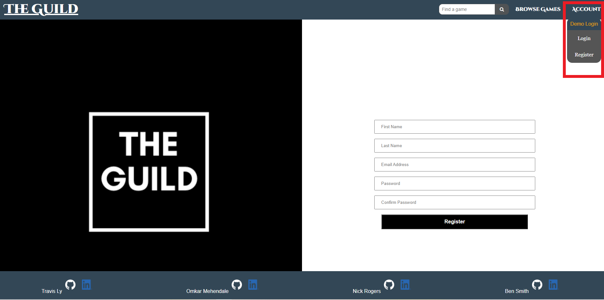

# [The Guild](https://the-guild-aa.herokuapp.com/demo)

The Guild is a GoodReads clone, but with a twist.  The Guild aims to build community amongst gamers, where relevant information about games can be found and shared.

## [GitHub Wiki Page](https://github.com/lytravis/express-project-The-Guild/wiki)

## Technologies Used
- JavaScipt
- Express
- Sequelize
- PUG
- CSS

## [Features ](https://github.com/lytravis/express-project-The-Guild/wiki/Feature-List) include:

  - Users can create, view, edit, and delete reviews for games
  - Users can leave ratings for games
  - Users can create, view, and delete game shelves
  - Users can view all the games listed on the site.

## [Database Schema](https://github.com/lytravis/express-project-The-Guild/wiki/Database-Schema)

## Contributors
- [Travis Ly](https://github.com/lytravis)
- [Omkar Mehendale](https://github.com/mehendaleo)
- [Nick Rogers](https://github.com/NR481)
- [Ben Smith](https://github.com/Bensmith0311)

## Capture the full experience
To enjoy the full experience with The Guild, it is recommended that users create an account, and log in to access key features.  The option to use a demo login is provided for convenience.  To use this feature, hover over the Accounts dropdown menu in the navigation bar on the far right, and click `demo login`
- Please see the image listed below for guidance:

